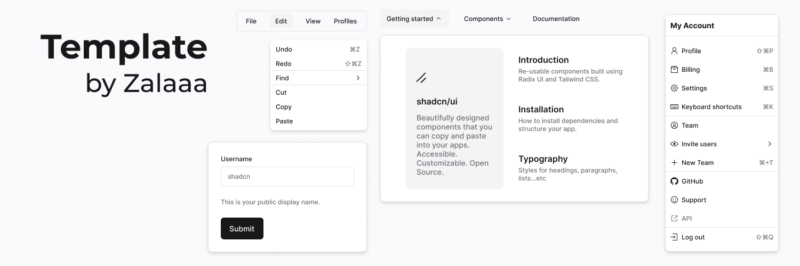

# 

# Project Template by Zalaaa

Welcome to the documentation of **Project Template By Zalaaa**. Here, I will leave some notes to help you get started with the template and begin using it to develop your app.

---

## Getting Started

1. **Clone the repository**:
    ```sh
    git clone https://github.com/your-repo-url.git
    ```
2. **Install dependencies**:
    ```sh
    npm install
    ```
3. **Run the development server**:
    ```sh
    npm run dev
    ```
4. **Build for production**:
    ```sh
    npm run build
    ```

This repository comes pre-installed with Shadcn UI using Vite, as well as react-router-dom and the Lucide-react icon packages.
